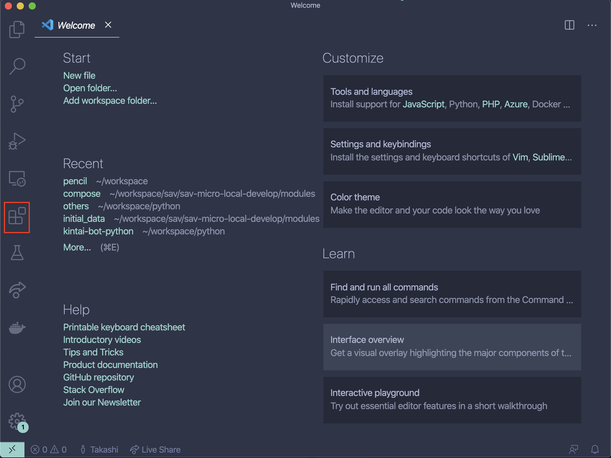
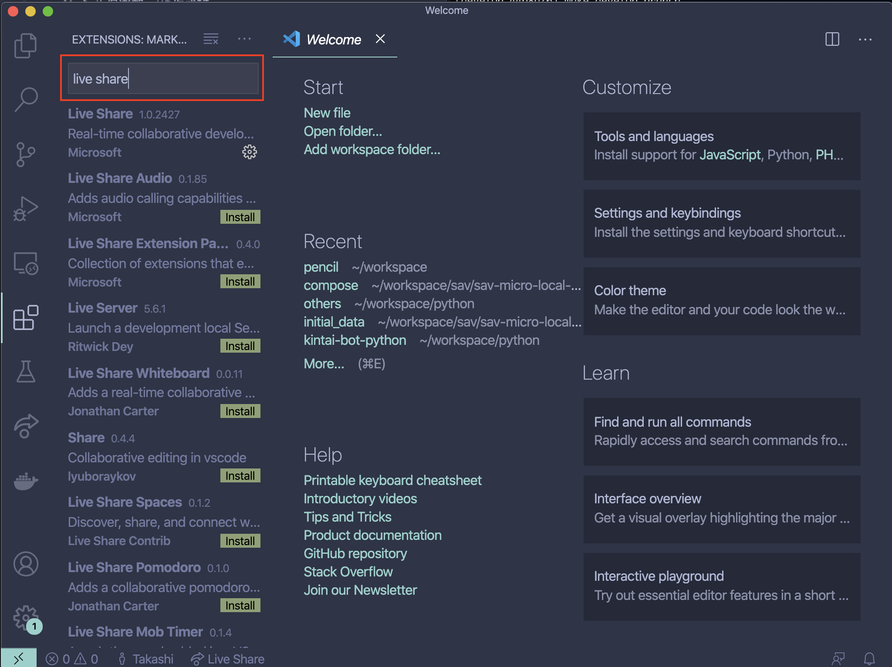
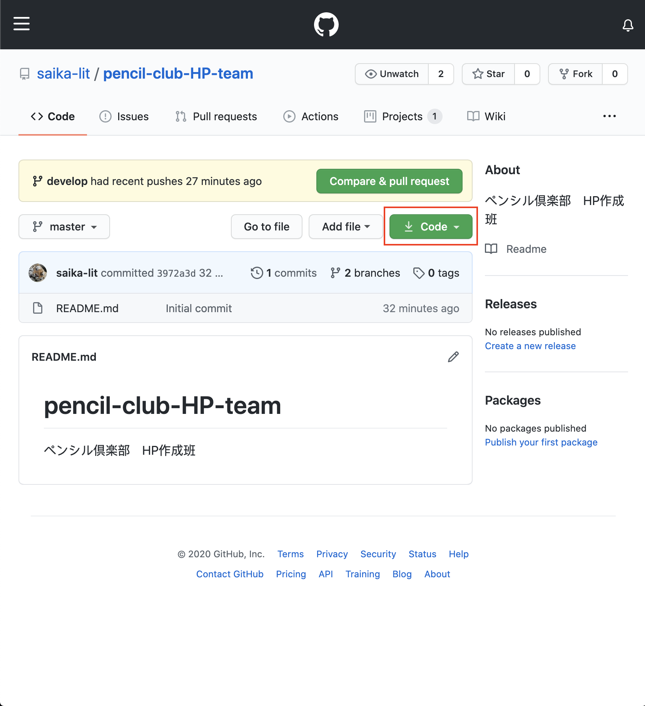

# pencil-club-HP-team
ペンシル倶楽部　HP作成班

## 開発環境構築
### Vscodeのインストール

[こちら](https://azure.microsoft.com/ja-jp/products/visual-studio-code/)のページからインストールしましょう。

### LiveShare拡張機能のインストール
開くと以下のような画面が見れるので、赤枠のボタン(拡張機能ボタン)を押す。



`Live Share`と調べて、一番上にあるやつをインストールする。(以下の画像参照)



### sassをインストール
#### Mac編
rubyが入っているかを確認
 
```bash
$ ruby --version
ruby 2.6.3p62 (2019-04-16 revision 67580) [universal.x86_64-darwin19]
// ↑ こんな感じで表示されるはず
```
※ ない人は別途相談

 sassのインストール

```bash
$ sudo gem install sass
```

### Windows編
よしなに調べてください…

### リポジトリのクローン
githubのページを開きCodeボタンを押す。



赤枠のボタンをクリックして、URLをコピーする

